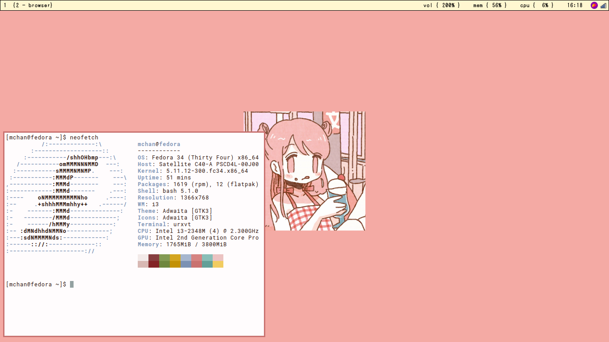
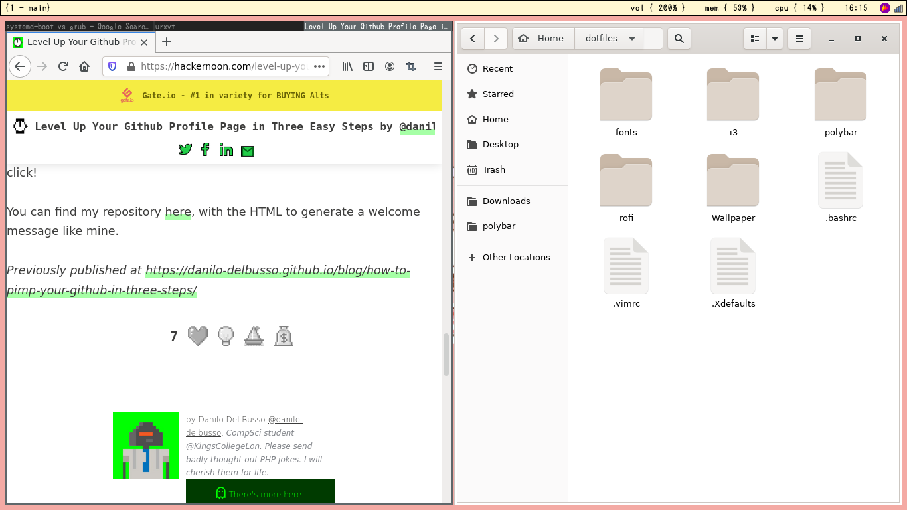

# dotfiles
my linux + i3 + rofi + polybar configuration. for back up purposes or sharing or whatever. Inspired by this person
[~~desktop~~ linux configutation](https://github/alnj/dotfiles)

## screenshots

## my plan
- [ ] Costumize the title bar (I turned the title bar in the i3 config, but they keep appear if i group a bunch of windows)
- [ ] Document every custom i3 hotkeys that i use

## more
Licensed under MIT