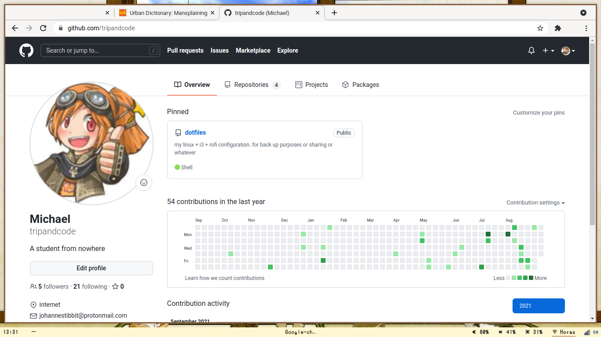
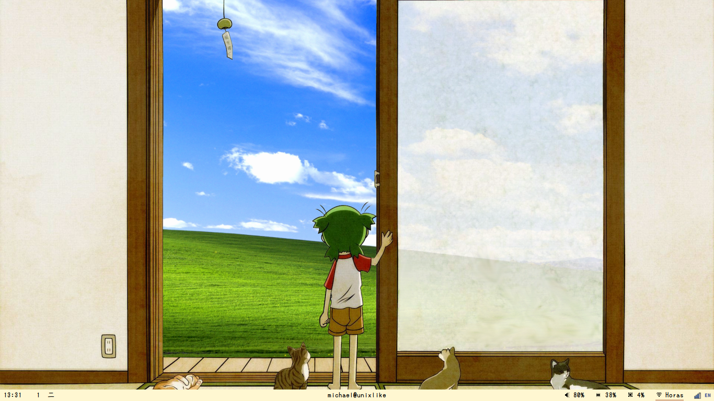

# dotfiles
my linux + i3 + rofi + polybar configuration. for back up purposes or sharing or whatever. Inspired by this person
[~~desktop~~ linux configutation](https://github.com/alnj/dotfiles)

## behind this configuration
### i3
I'm a student, wake up and prepare my book, pencils and anything else to attend my online school.
Opening classroom and my notion note (where i put anything important) quite taking time and hassle to me,
so I decided to add some line in my i3 to fire up notion and classroom in Google Chrome.

Later, If I figure out how to open 2 programs in 2 workspace. Probably I'll implement it.

### Polybar
There's a bug on nforro/i3-gaps (and also i3wm from fedora official repo) that makes program tray will block
the "X" button while i try to logout from i3. Also, polybar on top is quite boring and everybody use it.

## screenshots
### With Notion Google Classroom

### With rxvt-unicode terminal

### Blank/empty workspace

